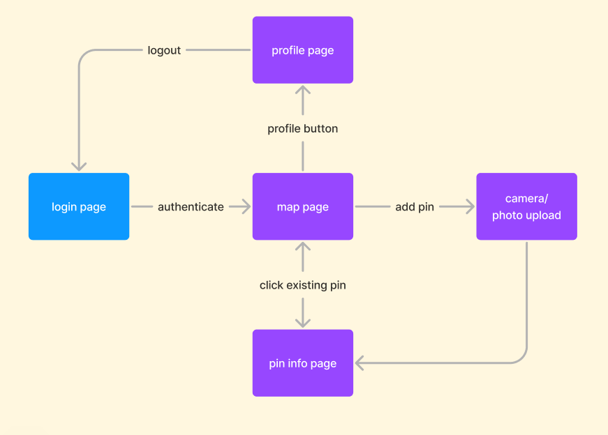
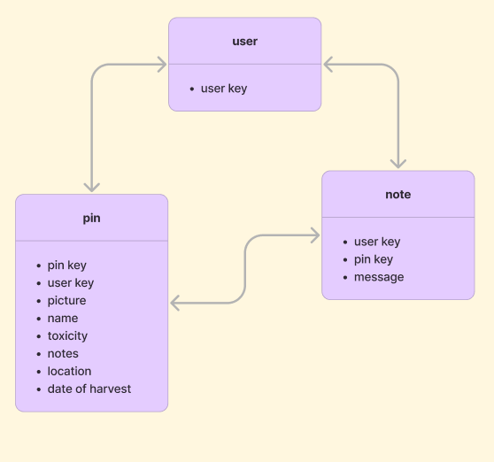

# Team S.L.L.A.B

## How to Run
* Navigate to folder mobile/forager and in terminal run
```
npm install
npx expo start
download Expogo in your phone
```
## What it does

## Inspiration

## Challenges we ran into

## Accomplishments that we're proud of


## What we learned


## What's next

## Artifacts and Planning
### State Machine


### ERD

## Build with
* react native
* firebase
* google maps api
* pytorch library
* toxic plant classification dataset
## Repo
