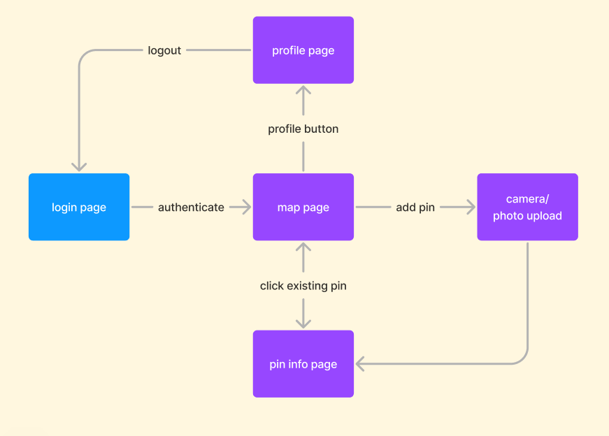
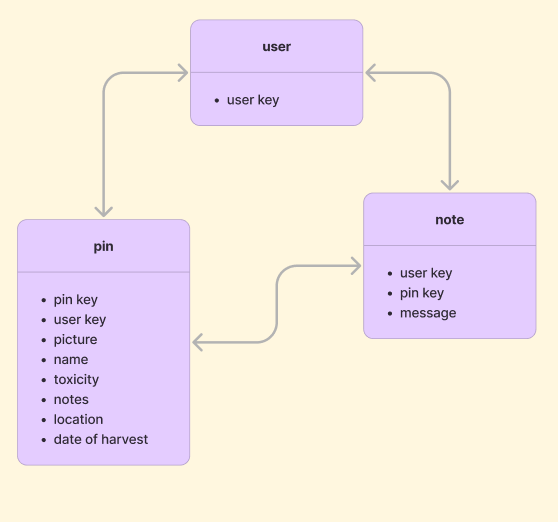

# App Name
* sustainability and shpiel about the app

## General Information
### How to Run
* navigate to folder mobile/forager and in terminal npx expo start

### Tecnology used
* react native
* firebase
* google maps api
* pytorch library
* toxic plant classification dataset

## Artifacts and Planning

### State Machine

### ERD

# Team S.L.L.A.B
#### to folder mobile/forager and in terminal npx expo start

## Inspiration

## What it does

## How we built it

## Challenges we ran into

## Accomplishments that we're proud of

## What we learned

## What's next

## Build with 

## Repo

